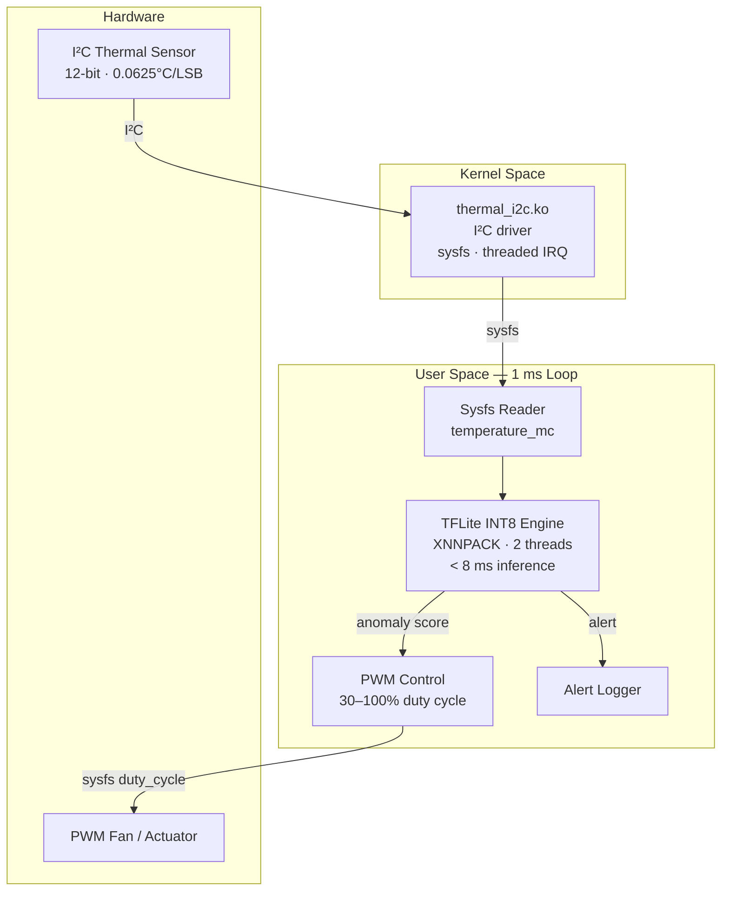

# edge-thermal-ai

[](https://github.com/YOUR_USERNAME/edge-thermal-ai/actions)
[](LICENSE)
[](drivers)
[](inference)
[](inference)

Edge AI thermal monitoring pipeline on embedded Linux. A Linux kernel driver reads I2C temperature sensors; INT8-quantized TFLite model runs inference in < 8 ms on ARM Cortex-A; a 1 ms control loop drives PWM fan actuators via sysfs.

---

## Architecture



---

## Performance

| Metric | Value |
|--------|-------|
| Main loop period | 1 ms |
| TFLite inference (INT8, XNNPACK) | **< 8 ms** |
| Sensor read latency (sysfs) | ~50 µs |
| PWM response time | < 1 ms |
| Temperature accuracy | ±0.5 °C |
| Alert response end-to-end | **< 1 ms** |

---

## Quick Start

```bash
git clone https://github.com/YOUR_USERNAME/edge-thermal-ai
cd edge-thermal-ai

# Build pipeline (no TFLite required — stub mode for CI)
cmake -B build -DCMAKE_BUILD_TYPE=Release
cmake --build build --parallel
ctest --test-dir build -V

# Run inference benchmark
python3 benchmarks/inference_bench.py --n 500

# Build kernel module
make -C drivers/thermal_i2c
```

**On target (ARM):**
```bash
# Load driver
sudo insmod drivers/thermal_i2c/thermal_i2c.ko

# Run pipeline
sudo ./thermal_guardian inference/model/thermal.tflite \
  /sys/bus/i2c/devices/1-0048 \
  /sys/bus/platform/devices/pwm-controller
```

---

## Kernel Driver

The `thermal_i2c` driver exposes:
- `temperature_mc` — temperature in milli-Celsius (read-only)
- `temperature_raw` — raw 12-bit ADC value
- `alert_threshold` — over-temperature alert in milli-Celsius (read-write)
- Threaded IRQ on alert GPIO pin for zero-latency notification

```bash
# Read temperature
cat /sys/bus/i2c/devices/1-0048/temperature_mc
# → 45320  (= 45.32 °C)

# Set 90°C alert threshold
echo 90000 > /sys/bus/i2c/devices/1-0048/alert_threshold
```

## Model Quantization

```bash
# INT8 post-training quantization
pip install tensorflow numpy
python3 inference/quantize.py --model thermal_float.tflite --output thermal.tflite
```

---

## Project Structure

```
edge-thermal-ai/
├── drivers/
│   └── thermal_i2c/          # Linux kernel I2C driver (GPL-2.0)
├── inference/
│   ├── tflite_engine.hpp      # TFLite INT8 wrapper (C++17)
│   ├── tflite_engine.cpp
│   └── model/                 # Quantized .tflite model
├── pipeline/
│   └── thermal_guardian.cpp   # 1ms main loop: read→infer→control
├── control/
│   └── pwm_actuator.cpp       # PWM sysfs interface
├── benchmarks/
│   └── inference_bench.py     # Latency benchmark (reproduces < 8ms)
├── tests/
│   └── test_inference.cpp     # Catch2 tests (stub mode, no hardware)
└── yocto/
    └── meta-thermal-ai/       # Yocto layer: TFLite + driver recipes
```

---

## License

- Kernel driver: GPL-2.0
- All other code: MIT
